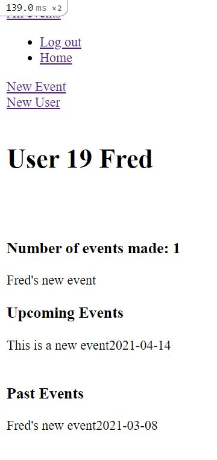
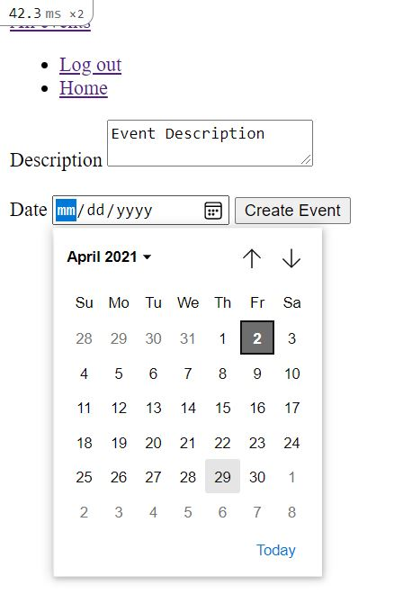
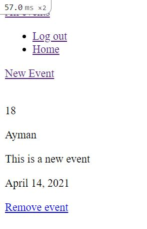

# Private Events
 This project consist of building a Private Event platform which allow visitor to sign up as a user, create events, attend to an event, edit and delete upcoming events.

## Built With
1. Major languages: Ruby, HTML/CSS
2. Frameworks: Ruby on Rails, Rspec

## Instructions
1. Download a clone locally git clone https://github.com/FrederickMih/Rails-private-events
2. Enter the project folder cd Rails-private-events
3. Enter the proper branch `git checkout feature/events-private`, or `git checkout development`
4. Add the necessary gems required in the Gemfile
5. Run bin/yarn install, in order to prevent `Webpacker::Manifest::MissingEntryError in Devise::Sessions#new` error
6. Install the necessary gems by using the command `bundle install`
7. Migrate the database using the command `rake db:migrate`
8. Run `rails server`, open a browser and go to http://127.0.0.1:3000/
9. Have fun.

## Testing with RSpec
1. After downloading the files, make sure to have the correct modules installed by running `bundle install`
2. Run `rails generate rspec:install`
3. Run `rails db:migrate RAILS_ENV=test`, to run the migrations in the test environment

## Authors :bust_in_silhouette:
### Frederick Mih
\_[Github: @FrederickMih](https://github.com/FrederickMih)
\_[LinkedIn: @Mih Frederick](https://www.linkedin.com/in/frederick-mih/)
### Ayman Jabr
\_[Github: @AymanJabr](https://github.com/AymanJabr/)
\_[LinkedIn: @Ayman Jabr](https://www.linkedin.com/in/ayman-jabr/)
## Show your support :star:️:star:️:star:️
Give a star if you like this project!
## License :memo:
# Released under MIT License

Copyright (c) 2021 Ayman Jabr.

Permission is hereby granted, free of charge, to any person obtaining a copy of this software and associated documentation files (the "Software"), to deal in the Software without restriction, including without limitation the rights to use, copy, modify, merge, publish, distribute, sublicense, and/or sell copies of the Software, and to permit persons to whom the Software is furnished to do so, subject to the following conditions:

THE SOFTWARE IS PROVIDED "AS IS", WITHOUT WARRANTY OF ANY KIND, EXPRESS OR IMPLIED, INCLUDING BUT NOT LIMITED TO THE WARRANTIES OF MERCHANTABILITY, FITNESS FOR A PARTICULAR PURPOSE AND NONINFRINGEMENT. IN NO EVENT SHALL THE AUTHORS OR COPYRIGHT HOLDERS BE LIABLE FOR ANY CLAIM, DAMAGES OR OTHER LIABILITY, WHETHER IN AN ACTION OF CONTRACT, TORT OR OTHERWISE, ARISING FROM, OUT OF OR IN CONNECTION WITH THE SOFTWARE OR THE USE OR OTHER DEALINGS IN THE SOFTWARE.